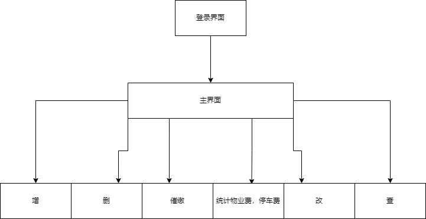
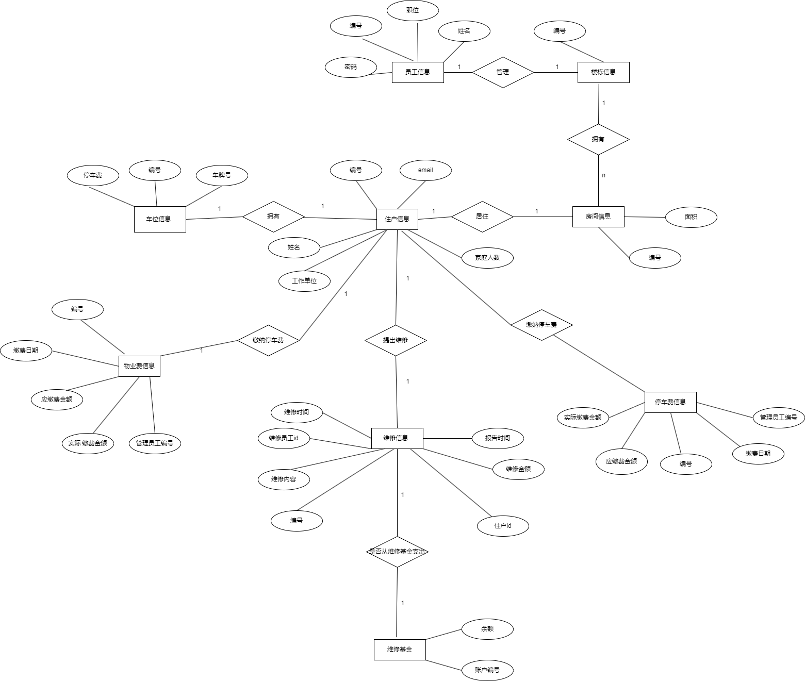
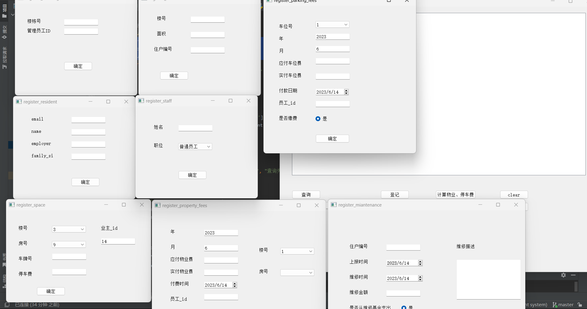
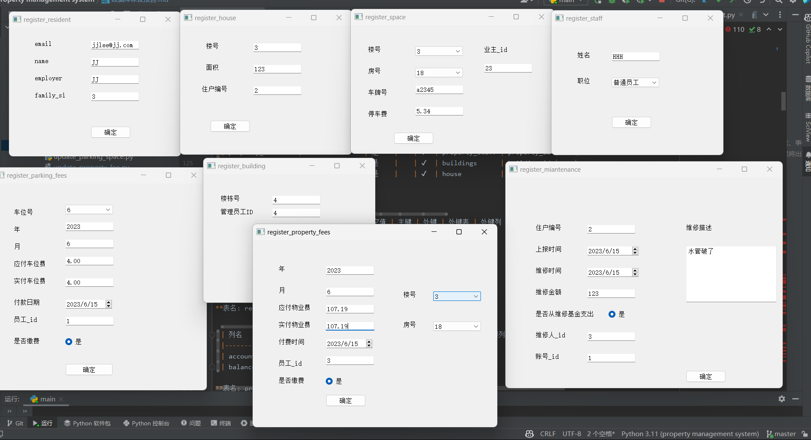
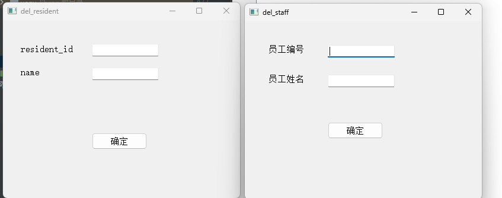
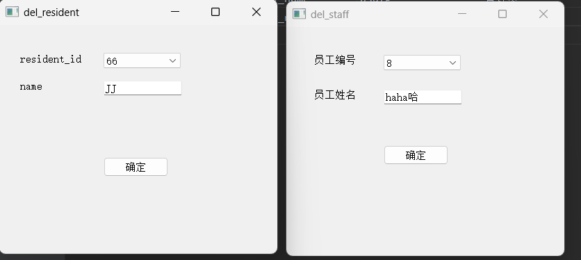
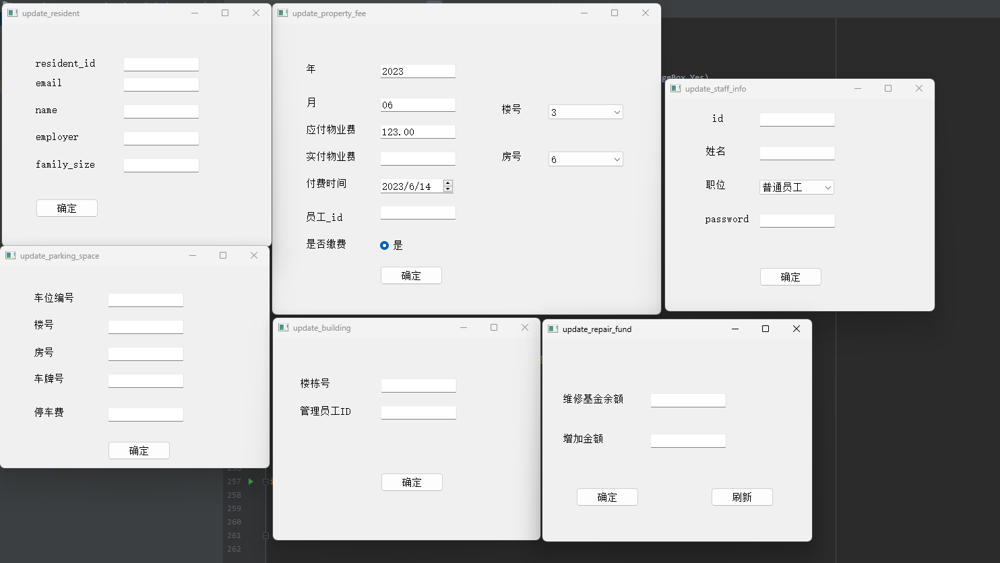
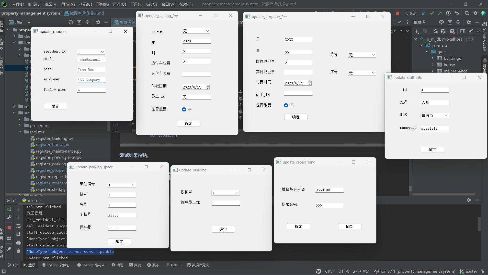
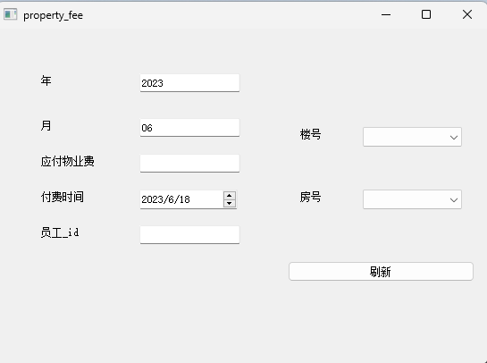
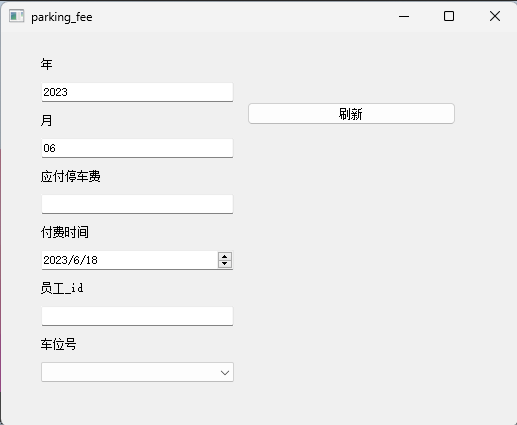

## 一、需求分析

### 1.1 问题描述：
本项目旨在开发一套高效率、无差错的住宅小区物业管理系统软件，用于管理小区的物业管理业务处理工作和用户的缴费工作。

* 管理员
  * 插入数据模块：用于插入住户信息、物业费缴费信息、停车位信息、停车费缴费信息、维修信息等。
  * 删除数据模块：用于删除住户信息、物业费缴费信息、停车位信息、停车费缴费信息、维修信息等。
  * 修改数据模块：用于修改住户信息、物业费缴费信息、停车位信息、停车费缴费信息、维修信息等。
  * 查询数据模块：用于查询住户信息、物业费缴费信息、停车位信息、停车费缴费信息、维修信息等。
  * 统计数据模块：用于统计住户信息、物业费缴费信息、停车位信息、停车费缴费信息、维修信息等。
  * 催缴费模块：用于催缴物业费、停车费等。

* 用户
  * 缴停车费
  * 缴物业费
### 1.2 系统功能描述：
* a 基本信息及处理功能：
  - 插入数据功能：用于插入住户信息、物业费缴费信息、停车位信息、停车费缴费信息、维修信息等。
  - 删除数据功能：用于删除住户信息、物业费缴费信息、停车位信息、停车费缴费信息、维修信息等。
  - 修改数据功能：用于修改住户信息、物业费缴费信息、停车位信息、停车费缴费信息、维修信息等。
  - 查询数据功能：用于查询住户信息、物业费缴费信息、停车位信息、停车费缴费信息、维修信息等。

* b 统计数据功能：用于统计住户信息、物业费缴费信息、停车位信息、停车费缴费信息、维修信息等。

* c 催缴费模块：用于催缴物业费、停车费等。

* d 用户缴费模块：用于用户缴纳物业费、停车费。




### 1.3 安全性与完整性要求：
- 数据库设计需要实施主键和外键约束，确保数据的完整性和一致性。
- 设定缺省约束，如缴费日期为系统当前日期，提高数据录入的准确性。
- 设置非空约束，如户主姓名、email，确保必填信息的完整性。
- 实施CHECK约束，如缴费金额应大于0，确保数据的合法性。
- 设计触发器，当某住户发生维修费用时，自动更新维修基金余额。
- 考虑系统的安全性，根据不同用户的权限设置系统的使用权限。
- 需要设计存储过程，用于查询和计算特定数据。
- 需要设计报表形式的汇总统计，包含明细信息和汇总信息，用于展示系统的统计结果。

注：在具体实施过程中，根据实际需求可能还需要进一步细化和补充功能。
## 二、数据库概念设计

### E-R图



## 三、逻辑结构设计

### 3.1 关系模式

数据字典：

**表名: buildings**

| 列名          | 数据类型 | 允许空值 | 主键 | 外键 | 外键表            | 外键列         | 索引 |
|-------------|------|------|----|----|----------------|-------------|----|
| building_id | int  | 否    | ✔  |    |                |             | ✔  |
| property_id | int  | 否    |    | ✔  | property_staff | property_id |    |

**表名: house**

|     列名      |      数据类型      | 允许空值 | 主键 | 外键 |    外键表    |     外键列     | 索引 |
|:-----------:|:--------------:|:----:|:--:|:--:|:---------:|:-----------:|:--:|
|  house_id   |      int       |  否   | ✔  |    |           |             |    |
| building_id |      int       |  是   |    | ✔  | buildings | building_id | ✔  |
|    area     | decimal(10, 2) |  是   |    |    |           |             |    |
| resident_id |      int       |  是   |    | ✔  | residents | resident_id | ✔  |


**表名: maintenance**

| 列名                  | 数据类型           | 允许空值 | 主键 | 外键 | 外键表            | 外键列         | 索引 |
|---------------------|----------------|------|----|----|----------------|-------------|----|
| maintenance_id      | int            | 否    | ✔  |    |                |             |    |
| resident_id         | int            | 是    |    | ✔  | residents      | resident_id | ✔  |
| description         | varchar(200)   | 是    |    |    |                |             |    |
| report_date         | date           | 是    |    |    |                |             |    |
| repair_date         | date           | 是    |    |    |                |             |    |
| amount              | decimal(10, 2) | 是    |    |    |                |             |    |
| is_from_repair_fund | char(2)        | 是    |    |    |                |             |    |
| repair_person       | int            | 是    |    | ✔  | property_staff | property_id | ✔  |
| account_id          | int            | 是    |    | ✔  | repair_fund    | account_id  |    |

**约束**:
- 约束名: Report_to_Repair
- 约束条件: `repair_date` > `report_date`


**表名: parking_fees**

| 列名               | 数据类型           | 允许空值 | 主键 | 外键 | 外键表            | 外键列              | 索引 |
|------------------|----------------|------|----|----|----------------|------------------|----|
| parking_fee_id   | int            | 否    | ✔  |    |                |                  |    |
| parking_space_id | int            | 是    |    | ✔  | parking_spaces | parking_space_id | ✔  |
| year             | int            | 是    |    |    |                |                  |    |
| month            | int            | 是    |    |    |                |                  |    |
| due_parking_fee  | decimal(10, 2) | 是    |    |    |                |                  |    |
| paid_parking_fee | decimal(10, 2) | 是    |    |    |                |                  |    |
| payment_date     | date           | 是    |    |    |                |                  |    |
| property_id      | int            | 是    |    | ✔  | property_staff | property_id      | ✔  |


**表名: parking_spaces**

| 列名               | 数据类型           | 允许空值 | 主键 | 外键 | 外键表       | 外键列         |
|------------------|----------------|------|----|----|-----------|-------------|
| parking_space_id | int            | 否    | ✔  |    |           |             |
| building_id      | int            | 是    |    | ✔  | buildings | building_id |
| house_id         | int            | 是    |    | ✔  | house     | house_id    |
| license_plate    | varchar(20     | 是    |    |    |           |             |
| parking_fee      | decimal(10, 2) | 是    |    |    |           |             |


**表名: property_fees**

| 列名                | 数据类型           | 允许空值 | 主键 | 外键 | 外键表            | 外键列         | 索引 |
|-------------------|----------------|------|----|----|----------------|-------------|----|
| property_fee_id   | int            | 否    | ✔  |    |                |             |    |
| year              | int            | 是    |    |    |                |             |    |
| month             | int            | 是    |    |    |                |             |    |
| due_property_fee  | decimal(10, 2) | 是    |    |    |                |             |    |
| paid_property_fee | decimal(10, 2) | 是    |    |    |                |             |    |
| payment_date      | date           | 是    |    |    |                |             |    |
| property_id       | int            | 是    |    | ✔  | property_staff | property_id | ✔  |
| building_id       | int            | 是    |    | ✔  | buildings      | building_id |    |
| house_id          | int            | 是    |    | ✔  | house          | house_id    |    |

**表名: residents**

| 列名          | 数据类型         | 允许空值 | 主键 | 外键 | 外键表 | 外键列 |
|-------------|--------------|------|----|----|-----|-----|
| resident_id | int          | 否    | ✔  |    |     |     |
| email       | varchar(50)  | 否    |    |    |     |     |
| owner_name  | varchar(50)  | 否    |    |    |     |     |
| employer    | varchar(100) | 是    |    |    |     |     |
| family_size | int          | 是    |    |    |     |     |

**表名: repair_fund**

| 列名         | 数据类型           | 允许空值 | 主键 | 外键 | 外键表 | 外键列 |
|------------|----------------|------|----|----|-----|-----|
| account_id | int            | 否    | ✔  |    |     |     |
| balance    | decimal(10, 2) | 否    |    |    |     |     |

**表名: property_staff**

| 列名          | 数据类型        | 允许空值 | 主键 | 外键 | 外键表 | 外键列 |
|-------------|-------------|------|----|----|-----|-----|
| property_id | int         | 否    | ✔  |    |     |     |
| staff_name  | varchar(50) | 否    |    |    |     |     |

### 3.2 子模式设计

**视图名: build_house_resident**

| 列名          | 数据类型 | 允许空值 | 主键 | 外键 | 外键表 | 外键列 |
|-------------|------|------|----|----|-----|-----|
| building_id | int  | 否    |    |    |     |     |
| house_id    | int  | 否    | ✔  |    |     |     |
| resident_id | int  | 否    |    |    |     |     |


## 四、物理结构设计

## 五、数据库设计实现及运行

### 5.1 数据库的创建

```sql
    create database p_m_db;
    use p_m_db;
```

### 5.2 数据表的创建

```sql
-- auto-generated definition
create table buildings
(
    building_id int auto_increment
        primary key,
    property_id int null,
    constraint buildings_ibfk_1
        foreign key (property_id) references property_staff (property_id)
            on update cascade on delete cascade
);


-- auto-generated definition
create table house
(
    house_id     int auto_increment
        primary key,
    building_id  int            null,
    area         decimal(10, 2) null,
    resident_id  int            null,
    property_fee decimal(10, 2) not null,
    constraint house_ibfk_1
        foreign key (building_id) references buildings (building_id)
            on update cascade on delete cascade,
    constraint house_ibfk_2
        foreign key (resident_id) references residents (resident_id)
            on update cascade on delete cascade
);


-- auto-generated definition
create table maintenance
(
    maintenance_id      int auto_increment
        primary key,
    resident_id         int            null,
    description         varchar(200)   null,
    report_date         date           null,
    repair_date         date           null,
    amount              decimal(10, 2) null,
    is_from_repair_fund char(2)        null,
    repair_person       int            null,
    account_id          int            null,
    constraint maintenance___fk
        foreign key (account_id) references repair_fund (account_id)
            on update cascade on delete cascade,
    constraint maintenance_ibfk_1
        foreign key (resident_id) references residents (resident_id)
            on update cascade on delete cascade,
    constraint maintenance_ibfk_2
        foreign key (repair_person) references property_staff (property_id)
            on update cascade on delete cascade,
    constraint Report_to_Repair
        check (`repair_date` > `report_date`)
);


-- auto-generated definition
create table parking_fees
(
    parking_fee_id   int auto_increment
        primary key,
    parking_space_id int            null,
    year             int            null,
    month            int            null,
    due_parking_fee  decimal(10, 2) null,
    paid_parking_fee decimal(10, 2) null,
    payment_date     date           null,
    property_id      int            null,
    is_paid          char           null,
    constraint parking_fees_ibfk_1
        foreign key (parking_space_id) references parking_spaces (parking_space_id)
            on update cascade on delete cascade,
    constraint parking_fees_ibfk_2
        foreign key (property_id) references property_staff (property_id)
            on update cascade on delete cascade
);

-- auto-generated definition
create table parking_spaces
(
    parking_space_id int auto_increment
        primary key,
    building_id      int            null,
    house_id         int            null,
    license_plate    varchar(20)    null,
    parking_fee      decimal(10, 2) null,
    resident_id      int            null,
    constraint parking_spaces_buildings_building_id_fk
        foreign key (building_id) references buildings (building_id)
            on update cascade on delete cascade,
    constraint parking_spaces_house_house_id_fk
        foreign key (house_id) references house (house_id)
            on update cascade on delete cascade,
    constraint parking_spaces_residents_resident_id_fk
        foreign key (resident_id) references residents (resident_id)
            on update cascade on delete cascade
);

-- auto-generated definition
create table property_fees
(
    property_fee_id   int auto_increment
        primary key,
    year              int                      null,
    month             int                      null,
    due_property_fee  decimal(10, 2)           null,
    paid_property_fee decimal(10, 2)           null,
    payment_date      date default (curdate()) null,
    property_id       int                      null,
    building_id       int                      null,
    house_id          int                      null,
    is_paid           char(2)                  not null,
    constraint property_fees_buildings_building_id_fk
        foreign key (building_id) references buildings (building_id)
            on update cascade on delete cascade,
    constraint property_fees_house_house_id_fk
        foreign key (house_id) references house (house_id)
            on update cascade on delete cascade,
    constraint property_fees_ibfk_1
        foreign key (property_id) references property_staff (property_id)
            on update cascade on delete cascade
);

-- auto-generated definition
create table repair_fund
(
    account_id int auto_increment
        primary key,
    balance    decimal(10, 2) null
);

-- auto-generated definition
create table residents
(
    resident_id int auto_increment
        primary key,
    email       varchar(50)  not null,
    owner_name  varchar(50)  not null,
    employer    varchar(100) null,
    family_size int          null
);


-- auto-generated definition
create table property_staff
(
    property_id int auto_increment
        primary key,
    staff_name  char(50)    not null,
    pass_word   varchar(20) null,
    position    varchar(50) null,
    constraint check_position
        check ((`position` = _utf8mb4'管理员') or (`position` = _utf8mb4'普通员工'))
);

```

### 5.3 视图创建

```sql
create definer = root@localhost view build_house_resident as
select `p_m_db`.`house`.`building_id` AS `building_id`,
       `p_m_db`.`house`.`house_id`    AS `house_id`,
       `p_m_db`.`house`.`resident_id` AS `resident_id`
from `p_m_db`.`house`;
```

### 5.4 存储过程

```sql
# Get_property_fee_info
create
    definer = root@localhost procedure Get_property_fee_info(IN year_ int, IN month_ int, OUT due_fee decimal(10, 2),
                                                             OUT paid_fee decimal(10, 2),
                                                             OUT not_paid_fee decimal(10, 2))
BEGIN
	SELECT SUM(due_property_fee), SUM(paid_property_fee) INTO due_fee, paid_fee
	FROM property_fees
	WHERE `year` = year_ AND `month` = month_;
	 
	SET not_paid_fee = due_fee - paid_fee;
END;
```
```python
# 调用代码
query = "CALL Get_property_fee_info(%s, %s, @deu_fee, @paid_fee, @unpaid_fee)"
            cursor.execute(query, (year, month))
            cursor.execute("SELECT @deu_fee, @paid_fee, @unpaid_fee")
            result = cursor.fetchone()

```
```sql
# Get_Property_fee_Parking_fee_Info
CREATE DEFINER=`root`@`localhost` PROCEDURE `Get_Property_fee_Parking_fee_Info`(
    IN p_building_id INT,
    IN p_house_id INT,
    OUT p_due_parking_fee DECIMAL(10,2),
    OUT p_due_property_fee DECIMAL(10,2)
)
BEGIN
    
    SELECT SUM(property_fee) INTO p_due_property_fee
    FROM house
    WHERE building_id = p_building_id AND house_id = p_house_id;
    
    
    SELECT SUM(parking_fee) INTO p_due_parking_fee
    FROM parking_spaces
    WHERE building_id = p_building_id AND house_id = p_house_id;
    
END
```
```python
# 调用代码
query = "CALL Get_Property_fee_Parking_fee_Info(%s, %s, @p_due_parking_fee, @p_due_property_fee)"
            cursor.execute(query, (building_id, house_id))
            cursor.execute("SELECT @p_due_parking_fee, @p_due_property_fee")
            result = cursor.fetchone()

```

```sql

# sum_parking_space
create
    definer = root@localhost procedure sum_parking_space(OUT sum_parking_space int)
BEGIN
		SELECT COUNT(DISTINCT `parking_space_id`) INTO sum_parking_space
		FROM parking_spaces;
END;
```
```python
# 调用代码
  query = 'call sum_parking_space(@sum_parking_space);'
            cursor.execute(query)
            cursor.execute('select @sum_parking_space;')
            result = cursor.fetchall()
```

```sql
  # sum_resident
create
    definer = root@localhost procedure sum_resident(OUT sum_resident int)
BEGIN
		SELECT COUNT(DISTINCT `resident_id`) INTO sum_resident
		FROM residents;
END;
```

```python
# 调用代码
  query = 'call sum_resident(@sum_resident);'
            cursor.execute(query)
            cursor.execute('select @sum_resident;')
            result = cursor.fetchall()
```

### 5.4 触发器

```sql
DELIMITER //

CREATE TRIGGER tr_maintenance
AFTER INSERT ON maintenance
FOR EACH ROW
BEGIN
    DECLARE amount_ DECIMAL(10,2);
    SET amount_ = NEW.amount;
    UPDATE repair_fund
    SET balance = balance - amount_;
END//

DELIMITER ;
```

### 5.5 自行设计各模块中所涉及的操作语句

#### 5.5.1 插入数据操作

**每个功能模块描述方法如下：**

* 插入员工信息
* 插入业主信息
* 插入房屋信息
* 插入车位信息
* 插入维修信息
* 插入楼栋信息
* 插入物业费信息
* 插入停车费信息

**功能界面；**

**功能界面简单描述；**
通过各个界面的提示信息进行插入数据操作
T-SQL语句与宿主语言嵌套使用代码段（粘贴）；
```python

# 插入员工信息
sql = '''INSERT INTO property_staff (staff_name, position) VALUES (%s, %s);'''
            cursor.execute(sql, values)
```

```python
# 插入业主信息
email = self.ui.lineEdit.text()

        #使用正则表达式判断邮箱格式
        pattern = re.compile(r'^[a-zA-Z0-9_-]+@[a-zA-Z0-9_-]+(\.[a-zA-Z0-9_-]+)+$')
        if not pattern.match(email):
            print("邮箱格式错误")
            QtWidgets.QMessageBox.warning(self, "Warning", "邮箱格式错误")
            return
        name = self.ui.lineEdit_2.text()
        employer = self.ui.lineEdit_3.text()
        family_size = self.ui.lineEdit_4.text()
        values = [email, name, employer, int(family_size)]
        conn = db_connect()
        cursor = conn.cursor()
        sql = '''INSERT INTO residents (email, owner_name, employer, family_size) VALUES (%s, %s, %s, %s);'''
        try:
            cursor.execute(sql, values)

        except Exception as e:
            print(e)
            return
        else:
            conn.commit()
            conn.close()
```

```python
# 插入房屋信息
 sql = '''INSERT INTO house (building_id, area, resident_id) VALUES (%s, %s, %s);'''
        try:
            cursor.execute(sql, values)
```

```python
# 插入车位信息

sql1 = '''SELECT resident_id FROM build_house_resident WHERE building_id = %s AND house_id = %s;'''
            values1 = [building_id, house_id]
            cursor.execute(sql1, values1)
            resident_id = cursor.fetchone()[0]
            parking_fee = self.ui.parking_fee.text()
            values = [building_id, house_id, license_plate,parking_fee, resident_id]
            sql2 = '''INSERT INTO parking_spaces (building_id, house_id, license_plate,parking_fee,resident_id) VALUES (%s, %s, %s, %s, %s);'''
            cursor.execute(sql2, values)
            conn.commit()
```

```python
# 插入维修信息
sql = '''insert into maintenance(resident_id, description, report_date, repair_date, amount, repair_person, is_from_repair_fund, account_id)
             values(%s, %s, %s, %s, %s, %s, %s, %s)'''
            cursor.execute(sql, values)
```

```python
# 插入楼栋信息
 sql = '''INSERT INTO buildings (building_id, property_id) VALUES (%s, %s);'''
        try:
            cursor.execute(sql, values)
            conn.commit()
```
```python
# 插入物业费信息
sql = '''INSERT INTO property_fees (building_id, house_id, year, month, due_property_fee, paid_property_fee, 
            payment_date, property_id, is_paid) VALUES (%s, %s, %s, %s, %s, %s, %s, %s, %s);'''
            cursor.execute(sql, values)
```

```python
# 插入停车费信息
sql = '''INSERT INTO parking_fees (parking_space_id, year, month, due_parking_fee, paid_parking_fee, payment_date, property_id, is_paid) VALUES (%s, %s, %s, %s, %s, %s, %s, %s);'''
        try:
            cursor.execute(sql, values)
            conn.commit()

```

**测试结果粘贴；**


#### 5.5.2 删除数据操作

**每个功能模块描述方法如下：**

* 删除员工信息
* 删除业主信息

**功能界面；**

**功能界面简单描述；**
通过各个界面的提示信息进行删除数据操作

T-SQL语句与宿主语言嵌套使用代码段（粘贴）； 	

```python
# 删除员工信息
            sql = '''DELETE FROM property_staff WHERE property_id = %s and staff_name = %s;'''
            cursor.execute(sql, values)
```

```python

# 删除业主信息
        sql = '''DELETE FROM residents WHERE resident_id = %s and owner_name = %s;'''
        try:
            cursor.execute(sql, values)
            conn.commit()
            conn.close()
```
**测试结果粘贴：**


#### 5.5.3 修改数据操作

**每个功能模块描述方法如下：**
* 修改员工信息
* 修改业主信息
* 修改楼栋信息
* 修改物业费信息
* 修改车位信息
* 修改停车费信息

**功能界面（粘贴）；**

**功能界面简单描述；**
通过各个界面的提示信息进行修改数据操作

**T-SQL语句与宿主语言嵌套使用代码段；**
```python
# 修改员工信息
sql = '''UPDATE property_staff SET staff_name = %s, position = %s ,pass_word = %s where property_id = %s;'''
            cursor.execute(sql, values)
            conn.commit()
```


```python
# 修改业主信息
sql = '''UPDATE residents SET email = %s, owner_name = %s, employer = %s, family_size = %s WHERE resident_id 
            = %s;'''
            cursor.execute(sql, values)
            conn.commit()
```
```python
# 修改楼栋信息
sql = '''UPDATE buildings SET property_id = %s  WHERE building_id = %s;'''
            cursor.execute(sql, values)
            conn.commit()
```
```python

# 修改物业费信息
sql = '''UPDATE property_fees SET is_paid = '是',paid_property_fee = %s WHERE year = %s AND month = %s AND house_id = %s AND building_id = %s;'''
            cursor.execute(sql, (paid_property_fee, year, month, house_id, building_id))
            conn.commit()
```
```python
# 修改车位信息
sql = '''UPDATE parking_spaces SET building_id = %s, house_id = %s, license_plate = %s, parking_fee = %s WHERE parking_space_id = %s;'''
            cursor.execute(sql, values)
            conn.commit()

```

```python
# 修改停车费信息
sql = '''UPDATE parking_fees SET is_paid = '是',paid_parking_fee = %s WHERE parking_space_id = %s and year = %s and month = %s;'''
            cursor.execute(sql, values)
            conn.commit()
```
**测试结果粘贴；**


#### 5.5.4 用户界面

**用户界面描述方法如下：**
* 主界面

* 物业费

* 停车费

## 六、系统详细设计及实现

### 6.1 功能模块说明
* 登录模块：用于用户身份验证和登录系统。
* 插入数据模块：用于插入住户信息、物业费缴费信息、停车位信息、停车费缴费信息、维修信息等。
* 删除数据模块：用于删除住户信息、物业费缴费信息、停车位信息、停车费缴费信息、维修信息等。
* 修改数据模块：用于修改住户信息、物业费缴费信息、停车位信息、停车费缴费信息、维修信息等。
* 查询数据模块：用于查询住户信息、物业费缴费信息、停车位信息、停车费缴费信息、维修信息等。
* 统计数据模块：用于统计住户信息、物业费缴费信息、停车位信息、停车费缴费信息、维修信息等。
* 催缴费模块：用于催缴物业费、停车费等。

### 6.2 每个模块的关键语句及关键技术说明：
a) 登录模块：
- 关键语句：验证用户输入的用户名和密码是否匹配。
- 关键技术：使用数据库查询语句进行用户验证，并通过会话管理来记录用户登录状态。

* A 管理员界面
  * b) 插入数据模块：
    - 关键语句：包括住户信息、物业费缴费信息、停车位信息、停车费缴费信息、维修信息等的SQL语句。
    - 关键技术：使用数据库操作语言执行对相应信息表的插入操作。

  * c) 删除数据模块：
    - 关键语句：包括住户信息、物业员工信息的SQL语句。
    - 关键技术：使用数据库操作语言执行对相应信息表的删除操作。

  * d) 修改数据模块：
    - 关键语句：包括住户信息、物业费缴费信息、停车位信息、停车费缴费信息、维修信息等的SQL语句。
    - 关键技术：使用数据库操作语言执行对相应信息表的修改操作。

  * e) 查询数据模块：
    - 关键语句：包括住户信息、物业费缴费信息、停车位信息、停车费缴费信息、维修信息等的SQL语句。
    - 关键技术：使用数据库操作语言执行对相应信息表的查询操作，并根据条件组合构造查询语句。

  * f) 统计汇总模块：
    - 关键语句：包括统计小区的应交物业费总额、实收物业费、未交物业费总额等的SQL语句。
    - 关键技术：使用数据库操作语言执行对相关信息表的统计查询，并生成报表形式的统计结果。

  * g) 催缴模块：
    - 关键语句：根据条件查询即将到期或已过期未缴费的物业费和停车费的SQL语句。
    - 关键技术：使用数据库操作语言执行对相应信息表的查询操作，并通过email提醒用户。

* B用户界面
  - h）缴停车费模块
    * 关键语句：根据条件查询查询用户是否缴费，若未缴费，则进行缴费，若已缴费，则提示用户已缴费。
    * 关键技术：使用数据库操作语言执行对相应信息表的查询操作，并根据条件组合构造查询语句。
  - i）缴物业费模块
    * 关键语句：根据条件查询查询用户是否缴费，若未缴费，则进行缴费，若已缴费，则提示用户已缴费。
    * 关键技术：使用数据库操作语言执行对相应信息表的查询操作，并根据条件组合构造查询语句。


## 七、总结
本次系统设计是针对住宅小区物业管理的需求进行的。系统的主要目标是提供一个高效率、无差错的物业管理系统软件，使小区管理者和小区用户能够更好地维护各项物业管理业务处理工作。

在需求分析阶段，对系统功能进行了详细描述，并确定了各个功能模块，包括登录、住户信息管理、物业费缴费管理、停车位管理、停车费缴费管理、维修信息管理、信息维护、信息查询、统计汇总和催缴模块。每个模块的关键语句和关键技术也进行了说明。

在系统设计和实现阶段，需要进行数据库设计、数据完整性设计和物理设计。数据库设计包括表的设计、主键和外键约束的设置，以及适当的索引创建。数据完整性设计涉及缺省约束、非空约束、CHECK约束、触发器的设计等。

物业管理系统通过细致的需求分析、合理的数据库设计和功能模块的实现，能够有效地满足小区物业管理的需求。同时，系统具有用户友好的交互界面、容错处理和多种输入形式的支持，能够提供准确的统计汇总报表和催缴提醒，为小区管理者和用户提供方便快捷的物业管理服务。